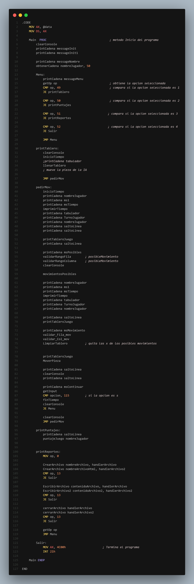
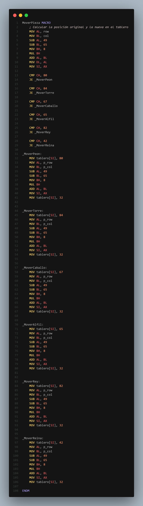

<h1 align="center">Practica 03</h1>

📕 Arquitectura De Computadoras y Ensambladores 1

 🏛 Universidad San Carlos de Guatemala

 📆 Primer Semestre 2024

### MANUAL TECNICO
#### Componentes del Sistema

El sistema consta de dos componentes principales:

- `main.asm`: Este es el archivo principal del programa. Contiene la lógica principal del juego de ajedrez, incluyendo el bucle de juego, el manejo de la entrada del usuario y la visualización del tablero de ajedrez.

- `macros.asm`: Este archivo contiene varias macros que se utilizan en todo el programa. Las macros son fragmentos de código que se pueden reutilizar en diferentes partes del programa. En este caso, se utilizan para realizar operaciones comunes como mover las piezas de ajedrez y comprobar el estado del juego.
