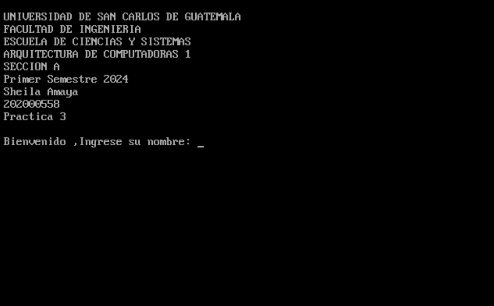
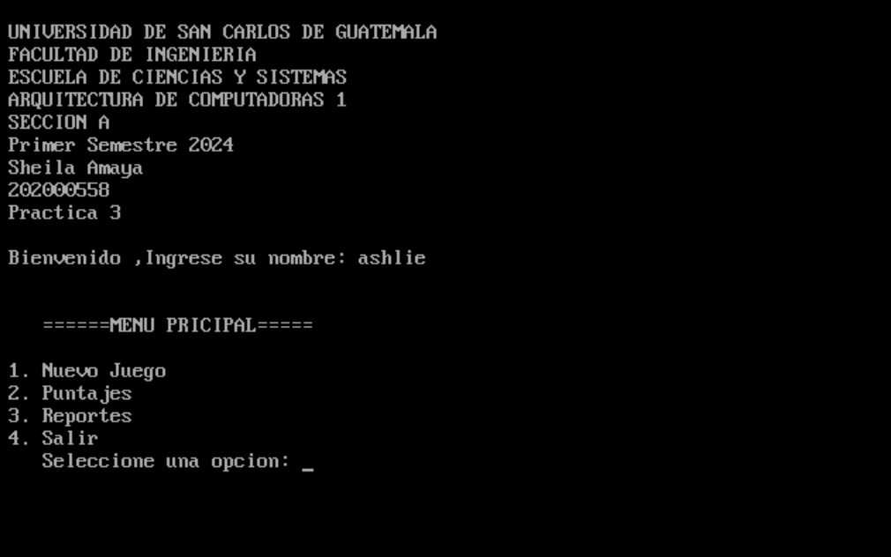
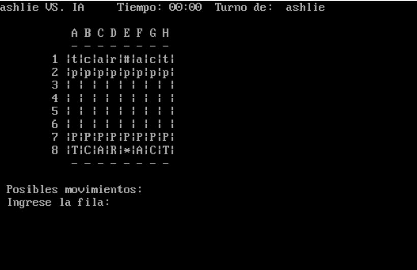
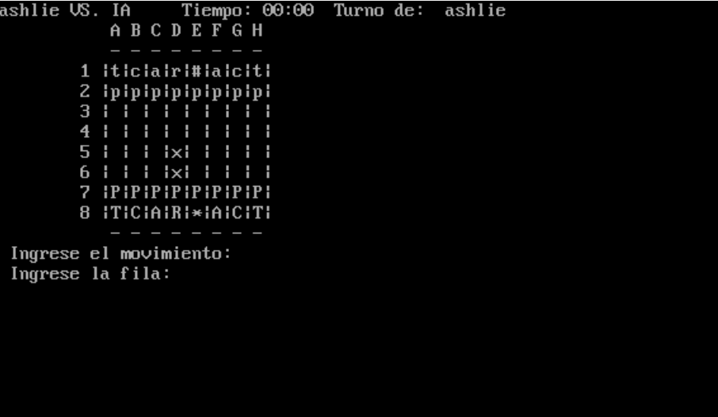
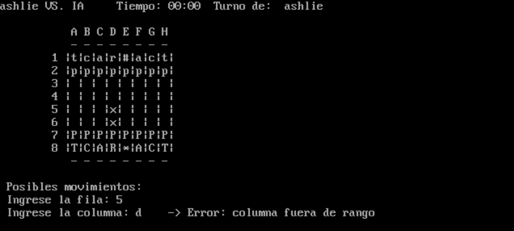
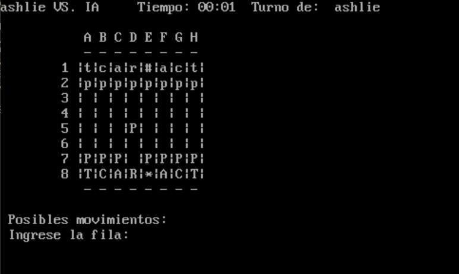
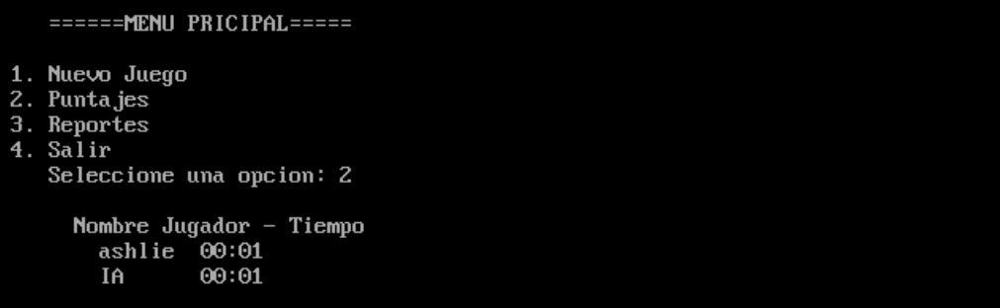
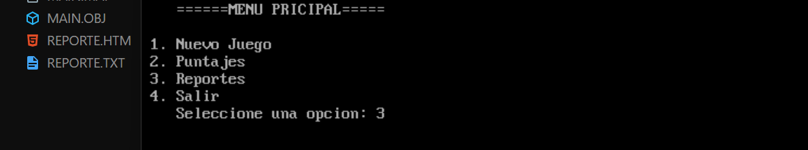

<h1 align="center">Practica 03</h1>

📕 Arquitectura De Computadoras y Ensambladores 1

 🏛 Universidad San Carlos de Guatemala

 📆 Primer Semestre 2024

### MANUAL DE USUARIO
#### INFORMACIÓN DEL SISTEMA
*Este programa, un juego de ajedrez, fue creado principalmente pensando en los usuarios de Windows. El juego permite a un jugadores competir en el mismo dispositivo con una IA. El jugador puede mover sus piezas de ajedrez de acuerdo con las reglas estándar del ajedrez. El programa fue escrito en lenguaje ensamblador y ha sido optimizado para Windows Vista y versiones superiores.*

#### RECURSOS NECESARIOS
- 2GB de RAM.
- Windows vista o superior.
- Arquitectura de 32 bits o 64 bits.

#### OBJETIVOS
- Aplicar los conocimientos de lenguaje ensamblador.
- Entender las interrupciones y el uso de la memoria en los programas.
- Consolidar la escritura y lectura de archivos.
- Practicar operaciones aritméticas básicas a bajo nivel.
- Desarrollar habilidades de resolución de problemas en lenguaje ensamblador.

#### FUNCIONAMIENTO DEL SISTEMA

1. *Al iniciar el programa muestra los datos del estudiante responsable de armar la aplicacion.*

2. *Luego de ingresar el nombre del usuario que hara uso de la aplicacion, procede a desplegar el menu principal.*

3. *La opcion 1 de nuevo juego genera la tablero de ajedrez con las piezas disponibles segun el turno de cada jugador.*

4. *Se visualizan los posibles movimientos de las pieza seleccionada antes de mover alguna a una posicion final*

5. *Si la columna o fila ingresada son incorrectas permite volver a ingresar fila y columna adecuadas al rango del tablero.*

6. *Permite mover piezas a las posibles posiciones*

7. *En puntajes es posible visualizar los jugadore y la IA que han ganado en la ultima partida realizada con el tiempo de juego.*

8. *Genera un reporte txt y html para la persistencia de datos de los puntajes.*

