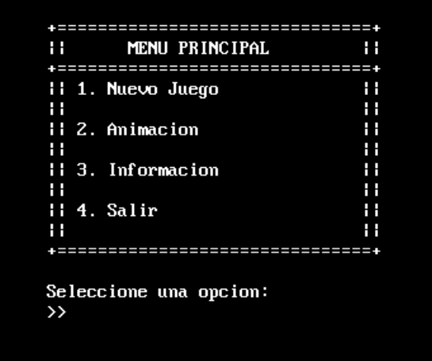
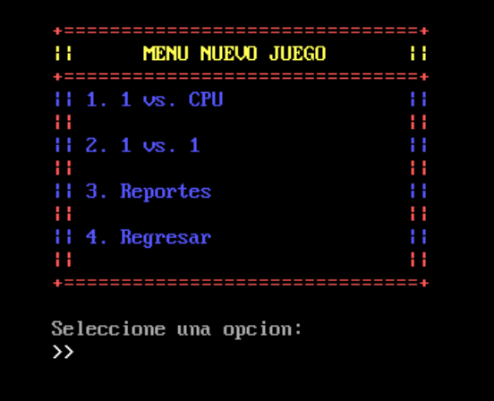
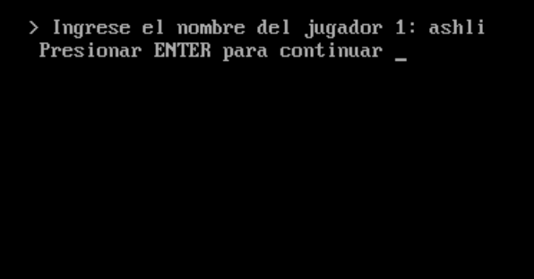
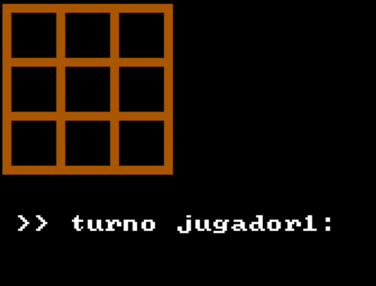
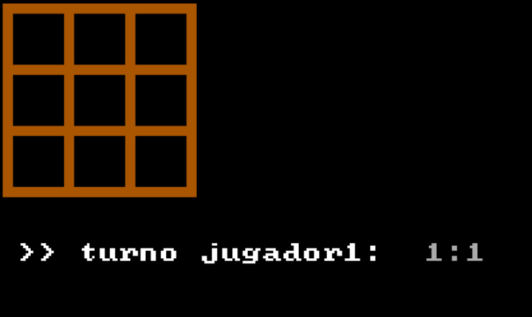
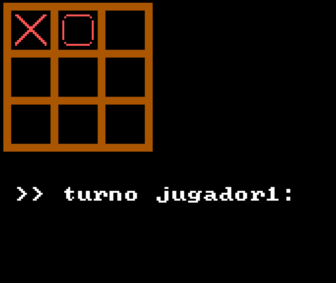

<h1 align="center">Practica 04</h1>

📕 Arquitectura De Computadoras y Ensambladores 1

 🏛 Universidad San Carlos de Guatemala

 📆 Primer Semestre 2024

### MANUAL DE USUARIO
#### INFORMACIÓN DEL SISTEMA
*Este programa es un juego de Tic Tac Toe (o Totito), fue creado principalmente pensando en los usuarios de Windows. El juego permite a los jugadores competir en el mismo dispositivo contra una IA. El jugador puede colocar sus marcas en el tablero de acuerdo con las reglas estándar del Tic Tac Toe. El programa fue escrito en lenguaje ensamblador y ha sido optimizado para Windows Vista y versiones superiores.*

#### RECURSOS NECESARIOS
- 2GB de RAM.
- Windows vista o superior.
- Arquitectura de 32 bits o 64 bits.

#### OBJETIVOS
- Aplicar los conocimientos de lenguaje ensamblador.
- Entender las interrupciones y el uso de la memoria en los programas.
- Consolidar la escritura y lectura de archivos.
- Practicar operaciones aritméticas básicas a bajo nivel.
- Desarrollar habilidades de resolución de problemas en lenguaje ensamblador.

#### FUNCIONAMIENTO DEL SISTEMA

1. *Al iniciar el programa muestra un menu de inicio.*

2. *En opcion uno redirecciona a un subMenu.*

3. *1 VS CPU pide el nombre de un solo jugador para competir con la IA.*

4. *genera el tablero y pide cordenadas para el jugador1.*

5. *Luego ingresa la cordenada y la dibuja en la posicion especificada, luego de que la IA genere su movimineto vuelve a pedir el turno del jugador1*

8. *Al finalizar la partida indica si gano jugador1, jugador2, IA o empate.*

