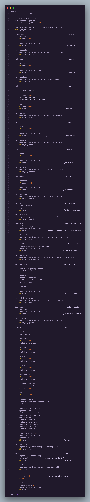
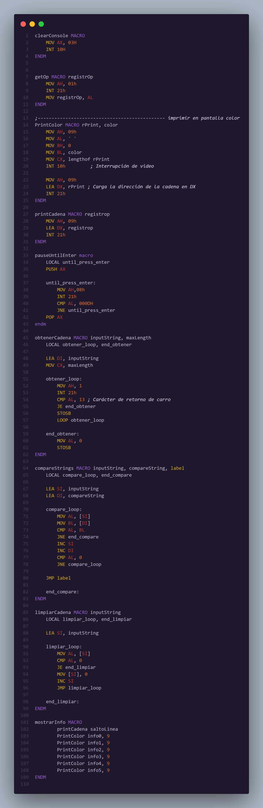

<h1 align="center">Proyecto 02</h1>

📕 Arquitectura De Computadoras y Ensambladores 1

 🏛 Universidad San Carlos de Guatemala

 📆 Primer Semestre 2024

### MANUAL TECNICO
#### Componentes del Sistema

El sistema consta de los siguientes componentes principales:

 - `main.asm`: Este es el archivo principal del programa. Contiene el código de inicio del programa y las llamadas a las diferentes funciones y procedimientos definidos en los otros archivos. También maneja la entrada y salida de datos, incluyendo la lectura del archivo CSV y la presentación de los resultados del análisis estadístico. Este archivo es el punto de entrada del programa y es el primero que se ejecuta cuando se inicia el programa.

- `macros.asm`: Este archivo contiene definiciones de macros que se utilizan en todo el programa. Las macros son fragmentos de código que se pueden reutilizar en diferentes partes del programa. Esto puede incluir operaciones comunes como la lectura y escritura de archivos, cálculos matemáticos y estadísticos, y la generación de gráficas. Al definir estas operaciones como macros, se puede reducir la duplicación de código y hacer que el programa sea más fácil de mantener y entender.

- `macros2.asm`: Este archivo es una extensión del archivo `macros.asm` y contiene definiciones adicionales de macros que se utilizan en el programa. Al igual que `macros.asm`, las macros definidas en este archivo pueden incluir operaciones comunes que se utilizan en varias partes del programa. La separación en dos archivos de macros puede ser útil para organizar mejor el código, especialmente si el programa es grande y complejo.
 

