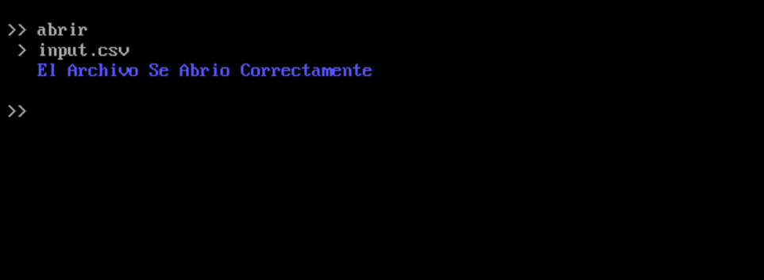
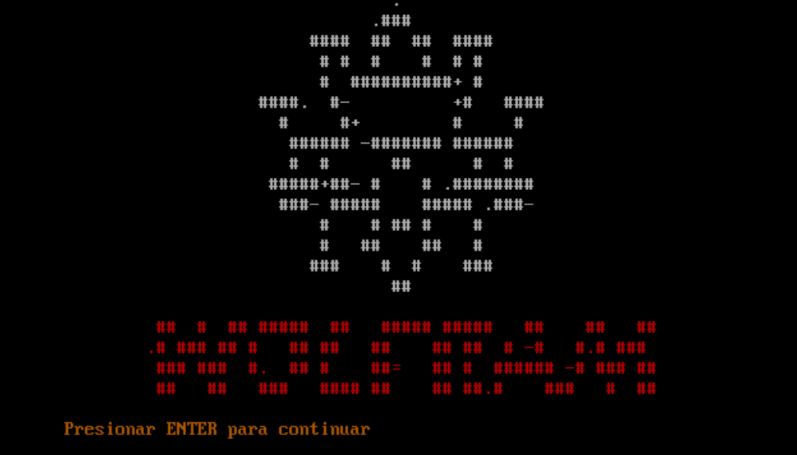
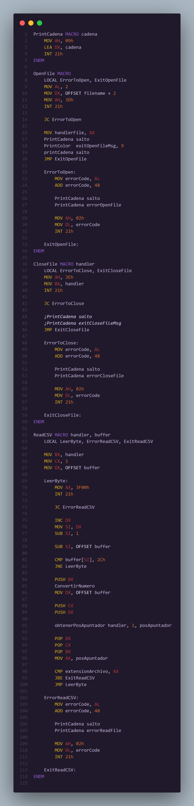

<h1 align="center">Proyecto 02</h1>

📕 Arquitectura De Computadoras y Ensambladores 1

 🏛 Universidad San Carlos de Guatemala

 📆 Primer Semestre 2024

### MANUAL DE USUARIO
#### INFORMACIÓN DEL SISTEMA
*...*

#### RECURSOS NECESARIOS
- 2GB de RAM.
- Windows vista o superior.
- Arquitectura de 32 bits o 64 bits.

#### OBJETIVOS
- Aplicar los conocimientos de lenguaje ensamblador.
- Entender las interrupciones y el uso de la memoria en los programas.
- Consolidar la escritura y lectura de archivos.
- Practicar operaciones aritméticas básicas a bajo nivel.
- Desarrollar habilidades de resolución de problemas en lenguaje ensamblador.

#### FUNCIONAMIENTO DEL SISTEMA

1. *Al iniciar el programa .*

2. **

3. *.*

4. *.*

5. *.*

8. **

