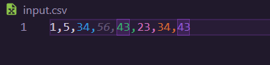

<h1 align="center">Proyecto 02</h1>

📕 Arquitectura De Computadoras y Ensambladores 1

 🏛 Universidad San Carlos de Guatemala

 📆 Primer Semestre 2024

### MANUAL DE USUARIO
#### INFORMACIÓN DEL SISTEMA
*Esta plataforma puede ejecutar varias métricas estadísticas y mostrarlas según se soliciten. Además, la plataforma puede generar varias gráficas para ayudar a los usuarios a comprender los datos que se están analizando.*

#### RECURSOS NECESARIOS
- 2GB de RAM.
- Windows vista o superior.
- Arquitectura de 32 bits o 64 bits.

#### OBJETIVOS
- Aplicar los conocimientos de lenguaje ensamblador.
- Entender las interrupciones y el uso de la memoria en los programas.
- Consolidar la escritura y lectura de archivos.
- Practicar operaciones aritméticas básicas a bajo nivel.
- Desarrollar habilidades de resolución de problemas en lenguaje ensamblador.

#### FUNCIONAMIENTO DEL SISTEMA

Para usar la plataforma de análisis de datos, sigue estos pasos:

1. *Al iniciar el programa muestra el logo de la aplicaion.*

1. *Prepar un archivo CSV con los datos que quieren analizar.*

2. *Por medio de comandos se puede acceder a funciones especificas de la aplicacion*

3. *Entre las funciones de la aplicacion estan: prom, moda, max,min,contador, graf_barra:asc, graf_barra_desc, graf_line ,abrir , limpiar*

4. *Generacion de un reporte con los datos obtenidos anteriormente de los comados en un txt*

